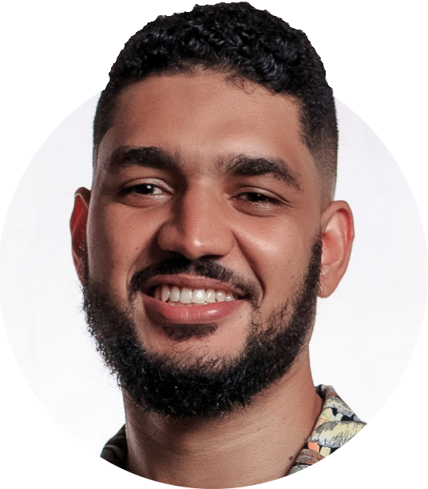

    

    
    <h1> Profissional de TI & Desenvolvedor de Sistemas </h1>
    
    <h2>Olá, sou o Wagner. Prazer em conhecê-lo!</h2>
        
        <section id="abstract">
            Atuo como Font-end Developer na <a id="huggy" href="https://www.huggy.io/" target="_blank">Huggy</a>, sou apaixonado pelo que faço e me encanta adiquirir novas habilidades relaconadas a TI. Ao longo dos mais de 10 anos que estudo e trabalho com tecnologia, já tive o prazer de participar de projetos de pesquisas acadêmicas e realizar projetos pessoas os quais me orgulho muito, todos essas etapas do meu aprendizado pode ser conferida nesta Landing Page.
        </section>
    

    
    <section id="banner"></section>
    
    <section id="skills">
        

            
        

        

            
        

    </section>
